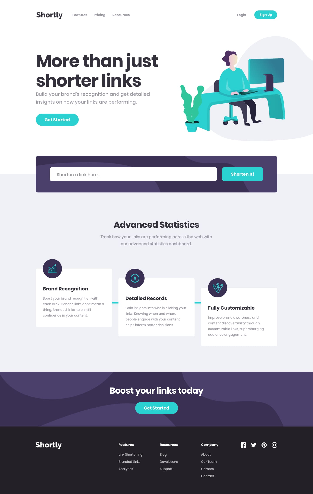

# Frontend Mentor - Shortly URL shortening API Challenge

Um desafio do Frontend Mentor que transforma Urls longas em Urls curtas, com o uso de uma API.

## 🃏 Design

### 💻 Desktop

### 📱 Mobile

## 🚀 Tecnologias utilizadas

- HTML
- CSS
- JavaScricpt
- API

## About

Nessa landing page eu utilizei a API https://tinyurl.com/ para o envio das informações da URL e retorno da mesma de uma
forma encurtada.